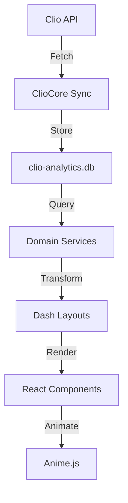

# Clio KPI Dashboard - Implementation Guide

## Overview

This guide documents the implementation of a modern, animated KPI dashboard for Clio legal practice management, integrating with the ClioCore modular backend.

## Architecture

### Technology Stack

```
┌─────────────────────────────────────────┐
│         User Interface Layer            │
│  React Components + Anime.js            │
│  (AnimatedKPI, TaskTracker, etc.)       │
└──────────────┬──────────────────────────┘
               │
┌──────────────▼──────────────────────────┐
│      Dash Application Layer             │
│  - app.py (Main application)            │
│  - layouts/ (4 dashboard views)         │
│  - callbacks/ (Data refresh logic)      │
└──────────────┬──────────────────────────┘
               │
┌──────────────▼──────────────────────────┐
│        ClioCore Domain Layer            │
│  - MatterLifecycle (matter operations)  │
│  - TaskActivity (task/activity ops)     │
└──────────────┬──────────────────────────┘
               │
┌──────────────▼──────────────────────────┐
│         Data Persistence Layer          │
│  clio-analytics.db (SQLite)             │
│  - Matters, Tasks, Users, Activities    │
└─────────────────────────────────────────┘
```

### Component Library (8 Core Components)

| Component | Purpose | Key Animation | Props |
|-----------|---------|---------------|-------|
| **AnimatedKPI** | Display key metrics | Number count-up (1.2s) | label, value, suffix, color |
| **StageProgressBar** | Show stage distribution | Width growth (0.8s) | stages[], onStageClick |
| **TaskTracker** | List tasks with status | Stagger fade-in (0.6s) | tasks[], highlightOverdue |
| **WorkloadCard** | Staff workload summary | Ring progress (1.0s) | userName, activeTasks, completionRate |
| **MatterBudget** | Budget tracking | Circular progress (1.2s) | allocated, spent, currency |
| **TaskTimeline** | Task timeline (Gantt) | Bar growth (1.0s) | tasks[], showProgress |
| **BottleneckRadar** | Bottleneck visualization | Radar animation (1.2s) | data[], maxValue, threshold |
| **WorkloadMatrix** | Workload heatmap | Grid stagger (0.5s) | data[][], stages[], users[] |

## Dashboard Views

### 1. Overview Dashboard (`layouts/overview.py`)

**Purpose**: Executive summary with high-level KPIs

**Key Metrics**:
- Total active matters
- Average days in stage
- Matters settled (this month)
- Bottleneck percentage
- Average staff workload

**Visualizations**:
- Practice area distribution (bar chart)
- Recent activity timeline (line chart)
- Urgent tasks table

**Data Sources**:
```python
matter_lifecycle.get_matters_overview()
task_activity.get_task_metrics()
task_activity.get_urgency_summary()
```

### 2. Lifecycle Dashboard (`layouts/lifecycle.py`)

**Purpose**: Visualize matter progression through workflow stages

**Key Features**:
- Horizontal stage progress bar (interactive)
- Average days per stage chart
- Sankey diagram (matter flow)
- Practice area × stage breakdown table

**Data Sources**:
```python
matter_lifecycle.get_stage_distribution()
matter_lifecycle.get_available_stages()
```

### 3. Department Dashboard (`layouts/department.py`)

**Purpose**: Team workload and performance analytics

**Key Metrics**:
- Total active tasks (team)
- Total overdue tasks (team)
- Team on-time rate
- Tasks completed

**Visualizations**:
- Workload distribution (stacked bar chart)
- Top performers leaderboard
- Detailed workload table

**Data Sources**:
```python
task_activity.get_user_workload()
task_activity.get_tasks_by_assignee()
```

### 4. Bottlenecks Dashboard (`layouts/bottlenecks.py`)

**Purpose**: Identify process bottlenecks and stuck matters

**Key Alerts**:
- Critical bottlenecks count
- Stuck matters count
- Average stuck duration
- Overdue tasks count

**Visualizations**:
- Bottleneck radar chart
- Time in stage analysis
- Stuck matters table (>90 days)
- Recommended action items

**Data Sources**:
```python
matter_lifecycle.get_stale_matters(days_threshold=90)
task_activity.get_tasks_by_urgency()
```

## Data Pipeline

### From Clio API to Dashboard



### Key Database Tables

**Matters**
```sql
SELECT
    ID, Description, Status, Practice_Area,
    Matter_Stage_ID, Responsible_Staff,
    Open_Date, Last_Activity_Date
FROM Matters
WHERE Status = 1  -- Active
```

**Tasks**
```sql
SELECT
    ID, Matter, Name, Status, Priority,
    Due_At, Completed_At, Assignee
FROM Tasks
WHERE Status IN (1, 2, 3)  -- Pending, In Progress, In Review
```

**Activities (for budget)**
```sql
SELECT
    Matter, SUM(CAST(Total AS REAL)) as spent
FROM Activities
WHERE Matter = ?
GROUP BY Matter
```

## Animation Strategy

### Timing & Easing Guidelines

| Context | Duration | Easing | Use Case |
|---------|----------|--------|----------|
| **Micro-interactions** | 200-400ms | `easeOutQuad` | Hover, click feedback |
| **Component entrance** | 500-800ms | `easeOutQuad` | Cards, panels appearing |
| **Data transitions** | 800-1200ms | `easeOutExpo` | Chart updates, KPI changes |
| **Progress indicators** | 1000-1500ms | `easeInOutSine` | Circular progress, bars |
| **Attention (pulse)** | 1200ms loop | `easeInOutSine` | Overdue indicators |

### Animation Patterns

**1. Number Count-Up (KPIs)**
```javascript
anime({
  targets: valueRef.current,
  innerHTML: [0, value],
  round: 10,
  easing: 'easeOutExpo',
  duration: 1200
});
```

**2. Staggered Entrance (Lists)**
```javascript
anime({
  targets: '.task-row',
  opacity: [0, 1],
  translateX: [-20, 0],
  delay: anime.stagger(100),
  duration: 600,
  easing: 'easeOutQuad'
});
```

**3. Circular Progress (Budget)**
```javascript
anime({
  targets: '.budget-progress',
  strokeDashoffset: [440, strokeDashoffset],
  easing: 'easeInOutSine',
  duration: 1200
});
```

**4. Grid Stagger (Matrix)**
```javascript
anime({
  targets: '.matrix-cell',
  opacity: [0, 1],
  scale: [0.8, 1],
  delay: anime.stagger(30, {
    grid: [users.length, stages.length],
    from: 'center'
  }),
  duration: 500,
  easing: 'easeOutBack'
});
```

## ClioCore Integration

### Domain Services

**MatterLifecycle** (`services/dashboard/domains/matter_lifecycle.py`)
```python
# Initialize
matter_lifecycle = MatterLifecycle(backend='sqlite')

# Get matters overview
matters_df = matter_lifecycle.get_matters_overview(limit=500)

# Get stage distribution
stages_df = matter_lifecycle.get_stage_distribution()

# Get available stages
stages_df = matter_lifecycle.get_available_stages()

# Get stale matters
stale_df = matter_lifecycle.get_stale_matters(days_threshold=90)
```

**TaskActivity** (`services/dashboard/domains/task_activity.py`)
```python
# Initialize
task_activity = TaskActivity(backend='sqlite')

# Get task metrics
metrics = task_activity.get_task_metrics()

# Get urgency summary
urgency = task_activity.get_urgency_summary()

# Get tasks by urgency
tasks_df = task_activity.get_tasks_by_urgency()

# Get user workload
workload_df = task_activity.get_user_workload()

# Get tasks by assignee
assignee_df = task_activity.get_tasks_by_assignee()
```

### Database Connection

The dashboard automatically detects the database location:

1. Check `CLIO_SQLITE` environment variable
2. Check Docker path: `/data/analytics/clio-analytics.db`
3. Check local path: `../dashboard-neo4j/data/analytics/clio-analytics.db`

## Deployment

### Development

```bash
# Quick start
./run_dashboard.sh

# Or manually
python3 -m venv venv
source venv/bin/activate
pip install -r requirements.txt
python dash_clio_dashboard/app.py
```

### Production (Docker)

```dockerfile
FROM python:3.11-slim

WORKDIR /app

# Install dependencies
COPY requirements.txt .
RUN pip install --no-cache-dir -r requirements.txt

# Copy application
COPY dash_clio_dashboard/ ./dash_clio_dashboard/
COPY src/ ./src/

# Expose port
EXPOSE 8050

# Run dashboard
ENV DASH_DEBUG=False
ENV DASH_PORT=8050
CMD ["python", "dash_clio_dashboard/app.py"]
```

### Docker Compose

```yaml
version: '3.8'

services:
  dashboard:
    build: .
    ports:
      - "8050:8050"
    environment:
      - DASH_DEBUG=False
      - CLIO_SQLITE=/data/clio-analytics.db
    volumes:
      - ../dashboard-neo4j/data/analytics:/data
    restart: unless-stopped
```

## Performance Optimization

### Best Practices

1. **Data Caching**
   - Use `@lru_cache` for expensive queries
   - Cache domain service results (30s TTL)

2. **Lazy Loading**
   - Load dashboard views on-demand
   - Defer heavy visualizations

3. **Debouncing**
   - Debounce filter inputs (300ms)
   - Throttle auto-refresh intervals

4. **Memoization**
   - Memoize Plotly figures
   - Cache processed DataFrames

### Example: Caching Domain Service Calls

```python
from functools import lru_cache
from datetime import datetime, timedelta

@lru_cache(maxsize=128)
def get_cached_matters(timestamp):
    """Cache matters data for 30 seconds"""
    matter_lifecycle = MatterLifecycle(backend='sqlite')
    return matter_lifecycle.get_matters_overview(limit=500)

# Usage
current_timestamp = datetime.now().replace(second=0, microsecond=0)
matters_df = get_cached_matters(current_timestamp)
```

## Future Enhancements

### Phase 2 (Next Sprint)
- [ ] Real-time WebSocket updates
- [ ] Advanced filtering (multi-select, date ranges)
- [ ] Export functionality (CSV, PDF reports)
- [ ] Dark mode toggle
- [ ] Mobile responsive breakpoints
- [ ] Custom dashboard builder (drag-drop)

### Phase 3 (Long-term)
- [ ] ML-powered bottleneck prediction
- [ ] Alerting & notifications (email, Slack)
- [ ] Multi-firm support
- [ ] Role-based access control (RBAC)
- [ ] Historical trend analysis
- [ ] Custom report builder

## Troubleshooting

### Common Issues

**1. ClioCore Not Found**
```
Warning: ClioCore not available
```
**Solution**: Ensure `dashboard-neo4j` project exists at `../dashboard-neo4j/`

**2. Database Connection Error**
```
Error: No such file or directory: clio-analytics.db
```
**Solution**: Set `CLIO_SQLITE` environment variable to correct path

**3. Missing Dependencies**
```
ModuleNotFoundError: No module named 'dash'
```
**Solution**: Run `pip install -r requirements.txt`

**4. Port Already in Use**
```
OSError: [Errno 98] Address already in use
```
**Solution**: Set different port with `export DASH_PORT=8051`

## Testing

### Manual Testing Checklist

- [ ] Dashboard loads without errors
- [ ] All 4 tabs render correctly
- [ ] KPI cards animate on load
- [ ] Charts display data (or mock data)
- [ ] Filters update visualizations
- [ ] Auto-refresh works (30s interval)
- [ ] Mobile view is readable
- [ ] No console errors

### Sample Data Verification

Run these queries to verify data availability:

```sql
-- Check matters count
SELECT COUNT(*) FROM Matters WHERE Status = 1;

-- Check tasks count
SELECT COUNT(*) FROM Tasks WHERE Status IN (1,2,3);

-- Check users count
SELECT COUNT(*) FROM Users;

-- Check stages
SELECT COUNT(*) FROM MatterStages;
```

## Support & Maintenance

### Monitoring

- Check application logs for errors
- Monitor database query performance
- Track dashboard load times
- Review user feedback

### Updating

```bash
# Pull latest changes
git pull origin main

# Update dependencies
pip install -U -r requirements.txt

# Restart dashboard
./run_dashboard.sh
```

## License & Credits

**Built with**:
- [Plotly Dash](https://dash.plotly.com/) - Python web framework
- [React](https://reactjs.org/) - UI components
- [Anime.js](https://animejs.com/) - JavaScript animation library
- [Bootstrap](https://getbootstrap.com/) - CSS framework
- ClioCore - Internal domain service architecture

**Author**: Development Team
**Version**: 0.1.0
**Last Updated**: 2025-10-09
